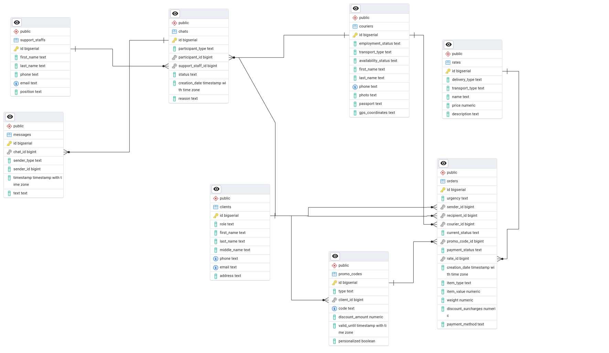

# MephiLab_DataBase

Лабораторная работа по курсу "Базы данных" в МИФИ.  
**Тема:** Сервис доставки.

Этот проект построен на **Go**, использует **GORM** в качестве ORM для **PostgreSQL** и пакет **gofakeit** для заполнения базы данных.

## Диаграмма

